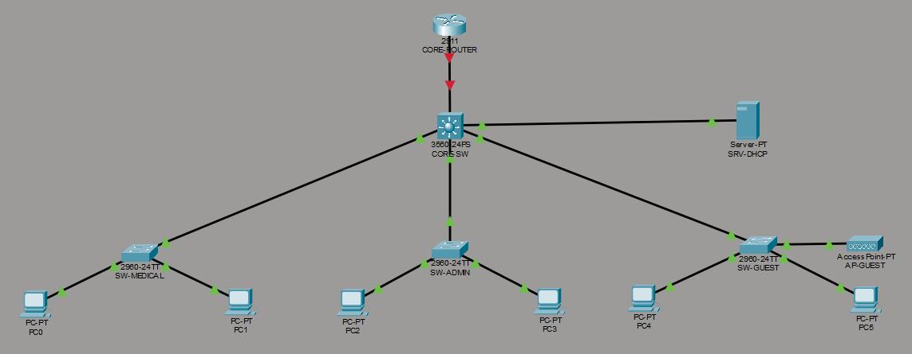
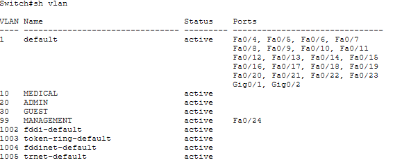
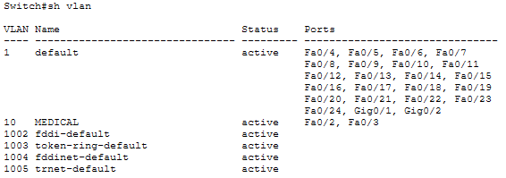
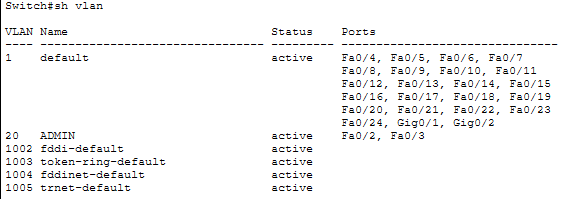
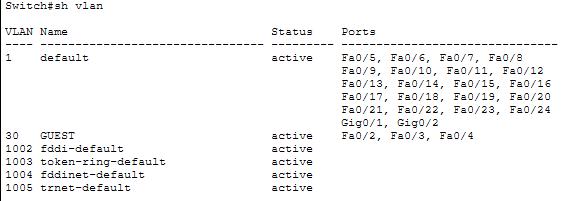
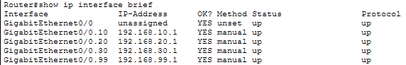
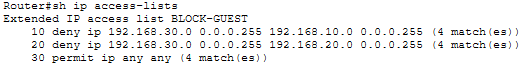
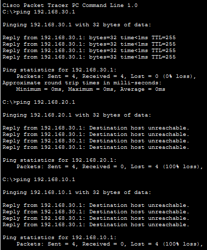

# Hospital Network Simulation 🏥

Simulation of a hospital network built in Cisco Packet Tracer as part of my CompTIA Network+ preparation.

## Project Goals
- Design a segmented hospital network using VLANs
- Apply subnetting to real-world infrastructure
- Configure inter-VLAN routing and basic ACLs
- Document the process for portfolio purposes

## Network Segments
| VLAN | Department |
|---|---|
| VLAN 10 | Medical Staff |
| VLAN 20 | Administration |
| VLAN 30 | Guest / Patient Wi-Fi |
| VLAN 99 | Management |

## Project Stages
- [x] Stage 1 – Physical topology
- [x] Stage 2 – VLANs & trunking
- [x] Stage 3 – IP addressing & subnetting
- [x] Stage 4 – Routing & ACLs
- [ ] Stage 5A – DHCP Server configuration
- [ ] Stage 5B – Port Security
- [ ] Stage 5C – Syslog & NTP

## Tools
- Cisco Packet Tracer 8.x
- CompTIA Network+ (Jason Dion, Udemy)

## Author
IT Systems Administrator | Studying Cybersecurity | Target: SOC Analyst

## Stage 1 – Physical Topology

## Stage 2 – VLAN Configuration

| Switch | VLAN | Name |
|---|---|---|
| SW-MEDICAL | 10 | MEDICAL |
| SW-ADMIN | 20 | ADMIN |
| SW-GUEST | 30 | GUEST |
| CORE-SW | 99 | MANAGEMENT |

## Stage 3 – IP Addressing & Subnetting

| VLAN | Name | Network | Gateway |
|---|---|---|---|
| 10 | MEDICAL | 192.168.10.0/24 | 192.168.10.1 |
| 20 | ADMIN | 192.168.20.0/24 | 192.168.20.1 |
| 30 | GUEST | 192.168.30.0/24 | 192.168.30.1 |
| 99 | MANAGEMENT | 192.168.99.0/24 | 192.168.99.1 |

Router-on-a-Stick configured on GigabitEthernet0/0 with subinterfaces per VLAN.
Inter-VLAN routing verified via ping (TTL=127 confirms traffic routed through router).

## Stage 4 – Routing & ACLs

Extended ACL `BLOCK-GUEST` applied inbound on Gig0/0.30 to isolate guest network from hospital infrastructure.

| Rule | Action |
|---|---|
| GUEST → MEDICAL | Denied |
| GUEST → ADMIN | Denied |
| GUEST → Router | Permitted |
| MEDICAL ↔ ADMIN | Permitted |

