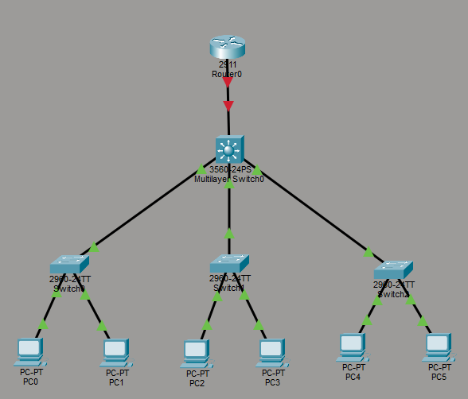

# Hospital Network Simulation 🏥

Simulation of a hospital network built in Cisco Packet Tracer as part of my CompTIA Network+ preparation.

## Project Goals
- Design a segmented hospital network using VLANs
- Apply subnetting to real-world infrastructure
- Configure inter-VLAN routing and basic ACLs
- Document the process for portfolio purposes

## Network Segments
| VLAN | Department |
|---|---|
| VLAN 10 | Medical Staff |
| VLAN 20 | Administration |
| VLAN 30 | Guest / Patient Wi-Fi |
| VLAN 99 | Management |

## Project Stages
- [x] Stage 1 – Physical topology
- [ ] Stage 2 – VLANs & trunking
- [ ] Stage 3 – IP addressing & subnetting
- [ ] Stage 4 – Routing & ACLs

## Tools
- Cisco Packet Tracer 8.x
- CompTIA Network+ (Jason Dion, Udemy)

## Author
IT Systems Administrator | Studying Cybersecurity | Target: SOC Analyst

## Stage 1 – Physical Topology

